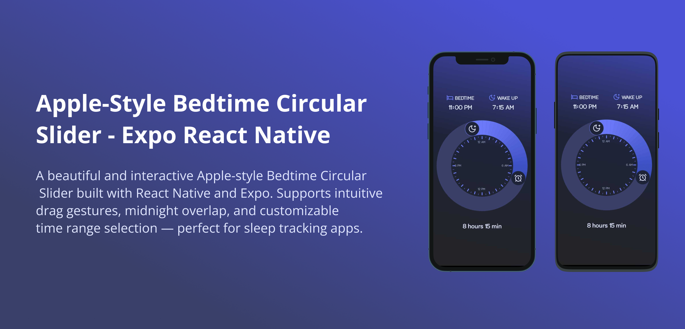

# 🛏️ Apple Bedtime Clock UI – Circular Time Picker in React Native (Expo)

A sleek, interactive **Apple-style Bedtime Clock UI** built with **React Native** and **Expo**. Ideal for **sleep tracking apps**, **bedtime planners**, or any interface that needs a **circular time range selector**.

Inspired by the iOS **Bedtime tab** from Apple's Clock app, this component supports smooth gestures, elegant transitions, and full Expo compatibility.

---



---

## 🚀 Features

- 🕒 Apple Bedtime-style **circular time picker**
- 🌙 **Midnight overlap** support (wrap-around arc)
- 🎯 Gesture-driven **start & end handles**
- ⚡ Powered by `react-native-reanimated` & `react-native-svg`
- 🎨 Customizable radius, colors, stroke, and resolution
- ✅ Works in **Expo** – no eject required
- 📱 Perfect for sleep apps, productivity tools, and UI demos

---

## 📦 Installation (Expo)

```bash
npx create-expo-app my-app
cd my-app

npm install react-native-reanimated react-native-gesture-handler react-native-svg
